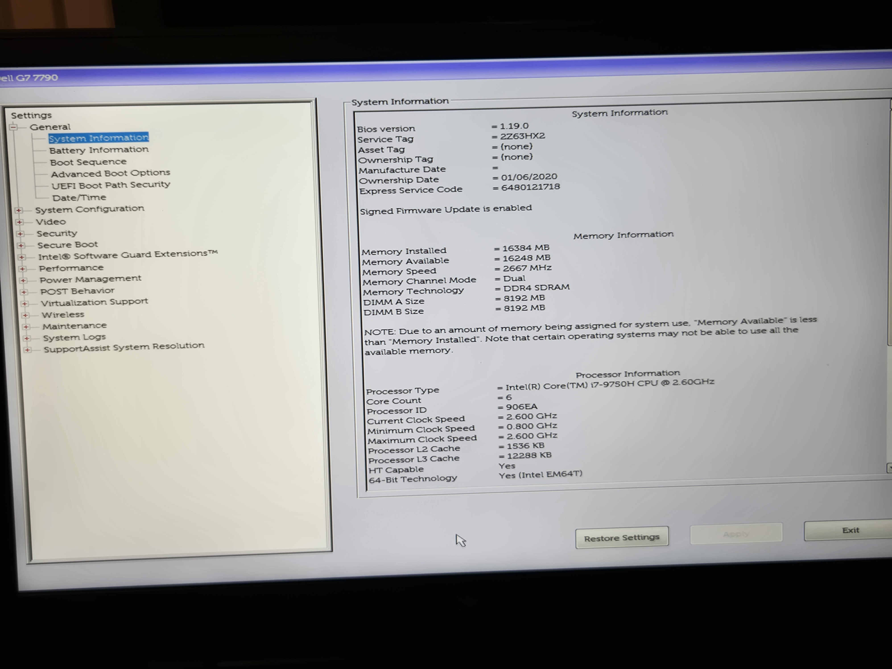
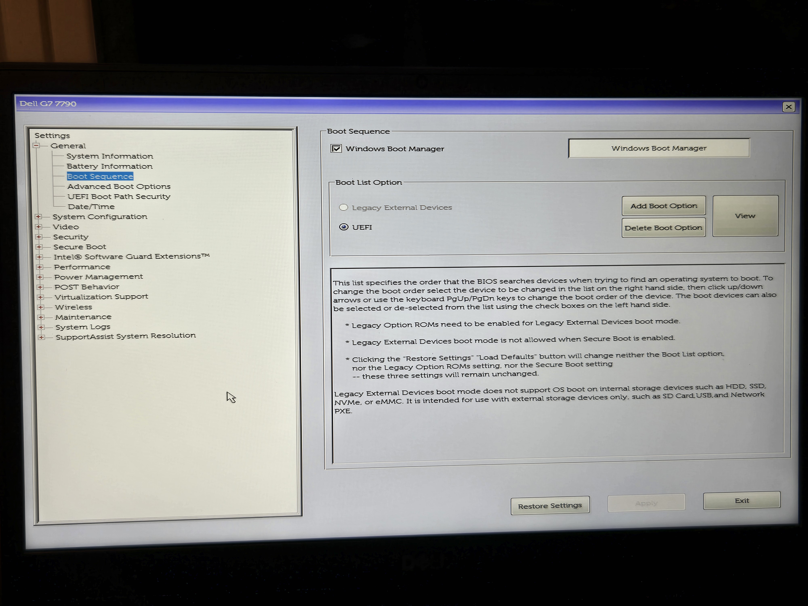
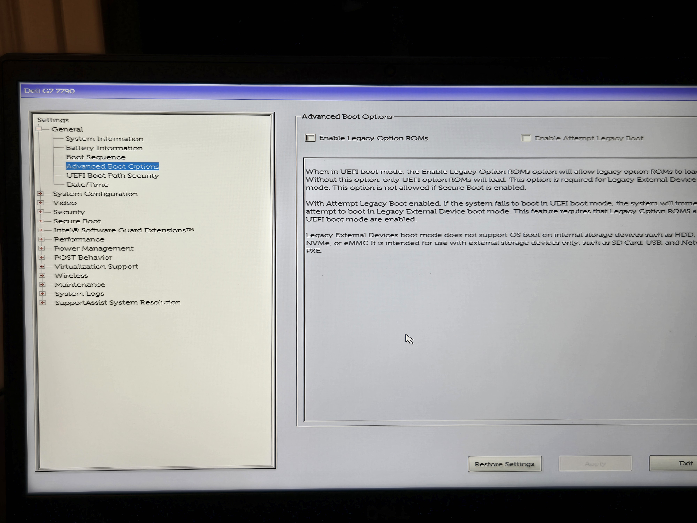
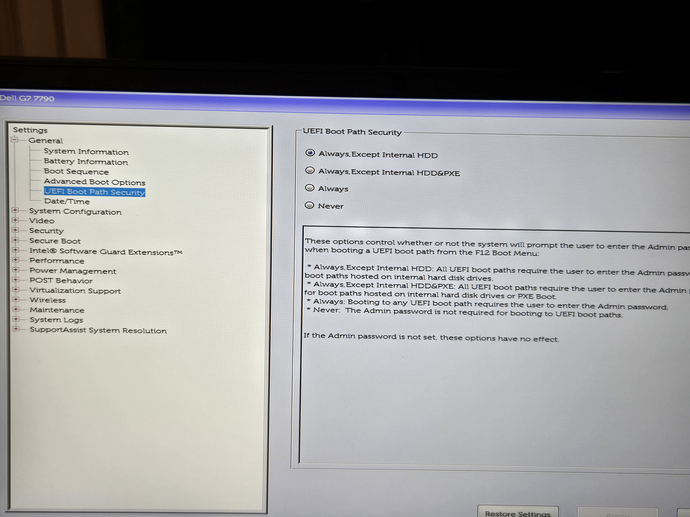
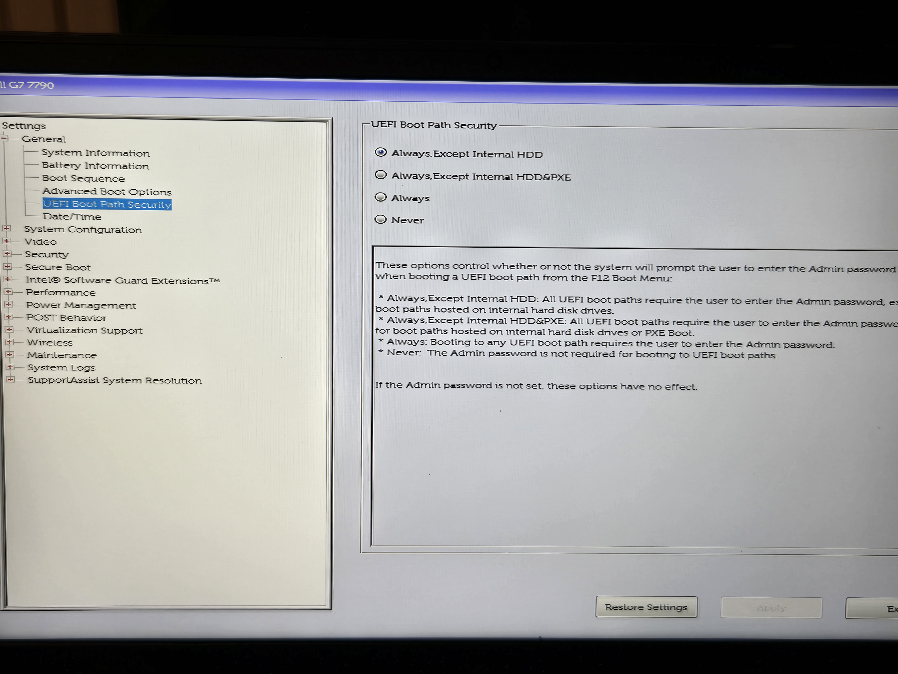
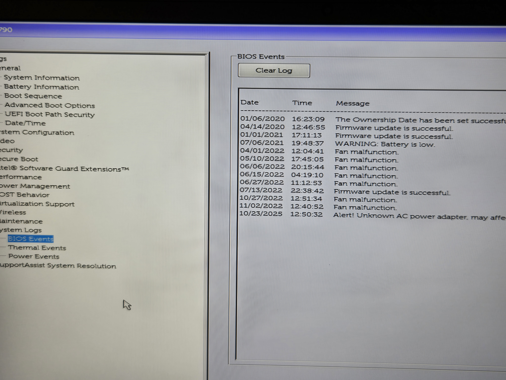
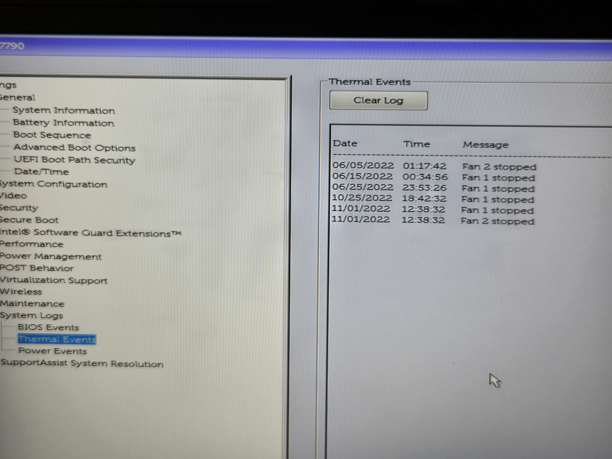
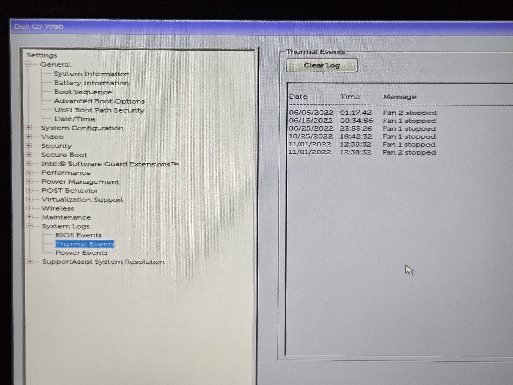
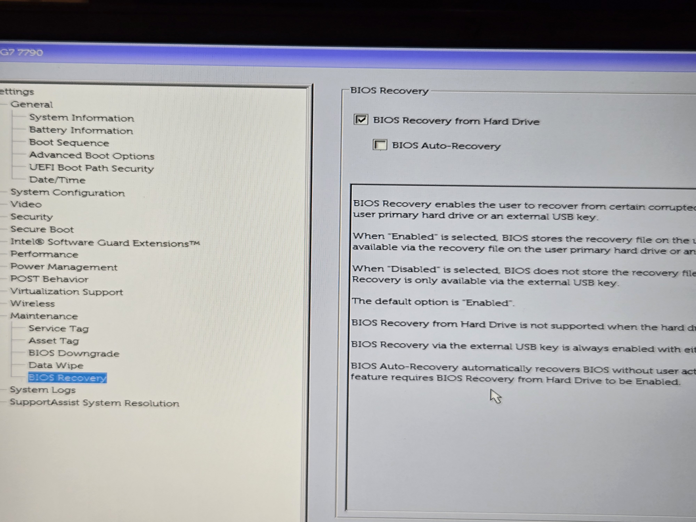

## 🧩 Windows BIOS Troubleshooting Lab

This lab demonstrates real BIOS settings and troubleshooting use cases based on my previous technical experience.  
Each section documents an action I’ve used in real scenarios, such as enabling virtualization, adjusting boot order, or checking system logs.

---

### 1️⃣ BIOS Main Page Overview
This is the main page of the Dell G7 BIOS interface.  
It lists all available configuration categories such as System Information, Boot Sequence, Security, and Virtualization Support.  
I often started here when running system diagnostics or preparing a machine to boot from external media during installations.  

Don, my cat, reminds me from the very beginning that he has my hand — or maybe I have his — in case I need a quidance. 🐾

---

### 2️⃣ Enabling Virtualization Support
This BIOS section shows where Intel Virtualization Technology can be enabled.  
Turning it on allows the CPU to support virtual machines and hardware acceleration — something I used when setting up Windows Server test environments and troubleshooting client-server connectivity during software installations.  

In practice, I worked with both **VirtualBox** and **VMware Workstation**, creating isolated virtual networks to simulate real deployment conditions.  
I installed the **server component of the software on a Windows Server virtual machine** and the **client component on a local machine**, verifying that the two could communicate properly through configured network ports.  
I tested these setups across **Windows Server 2012**, **Windows 10**, and **Ubuntu 18.04**, ensuring each environment could establish a stable connection once virtualization was enabled at the BIOS level.

---

### 3️⃣ Exploring the “General” BIOS Section
This group of settings covers core system information and boot configuration options in the Dell G7 BIOS.  
From here, I could review **hardware details** (like CPU model, RAM size, and BIOS version), as well as configure **boot priorities** and **UEFI security behavior**.  
In practice, I used these options when troubleshooting boot failures or preparing machines for OS installation from external media — in my case, over USB, though this process can also be performed over PXE in network environments.

---

### 4️⃣ System Logs and BIOS Recovery

This section records the system’s internal history — events related to hardware, cooling, and firmware updates.  
Accessing **System Logs** from BIOS helped me verify whether any hardware malfunctions (like fan errors or power adapter warnings) had occurred before troubleshooting deeper.  

For example, the **BIOS Events** log shows firmware update results and battery or fan alerts, while the **Thermal Events** log tracks cooling fan behavior — useful when diagnosing overheating or shutdown issues.  
The **Power Events** log would similarly capture changes in AC power adapters or unexpected shutdowns.

In the **Maintenance → BIOS Recovery** section, Dell BIOS provides recovery options that let users restore firmware from the internal hard drive or a USB key — a lifesaver when troubleshooting failed BIOS updates or startup issues.

