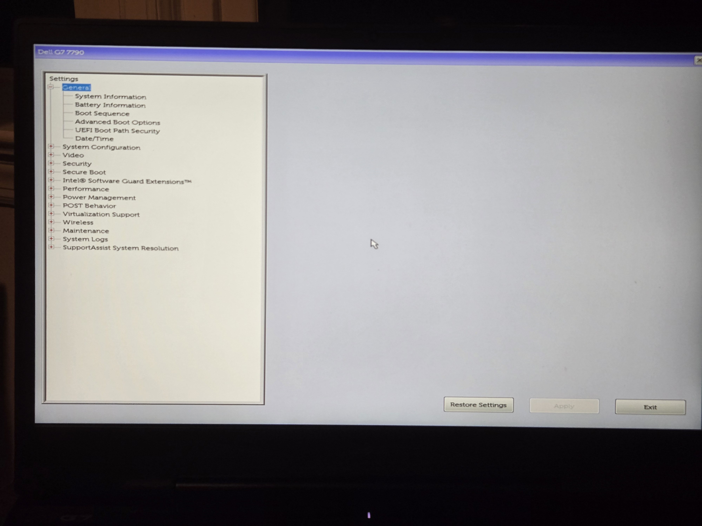
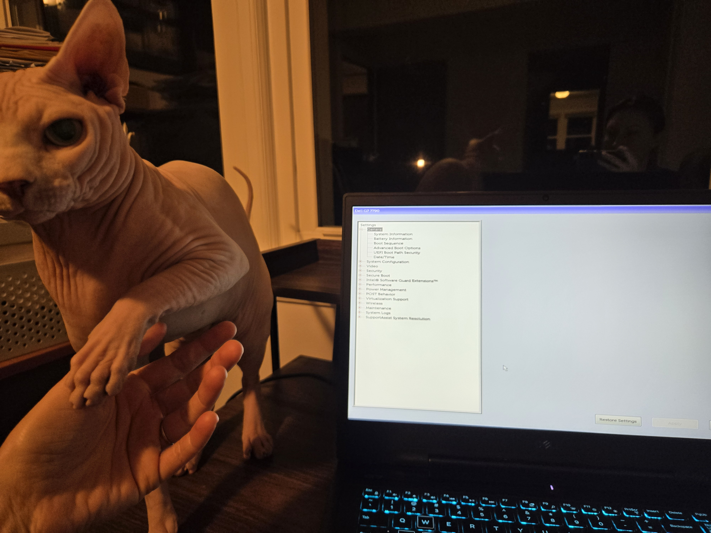
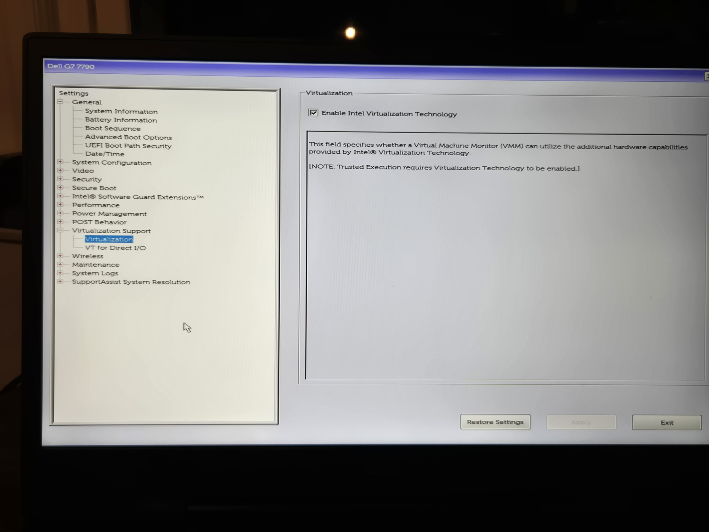

## 🧩 Windows BIOS Troubleshooting Lab

This lab demonstrates real BIOS settings and troubleshooting use cases based on my previous technical experience.  
Each section documents an action I’ve used in real scenarios, such as enabling virtualization, adjusting boot order, or checking system logs.

---

### 1️⃣ BIOS Main Page Overview
This is the main page of the Dell G7 BIOS interface.  
It lists all available configuration categories such as System Information, Boot Sequence, Security, and Virtualization Support.  
I often started here when running system diagnostics or preparing a machine to boot from external media during installations.  

Don, my cat, reminds me from the very beginning that he has my hand — or maybe I have his — in case I need a quidance. 🐾

---

### 2️⃣ Enabling Virtualization Support
This BIOS section shows where Intel Virtualization Technology can be enabled.  
Turning it on allows the CPU to support virtual machines and hardware acceleration — something I used when setting up Windows Server test environments and troubleshooting client-server connectivity during software installations.

